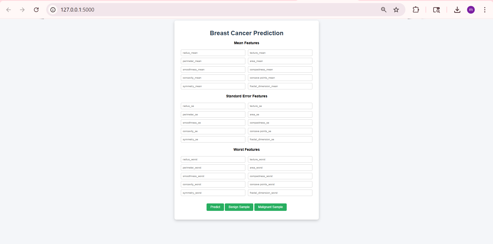

# 🧠 Breast Cancer Prediction using Machine Learning

## 📌 Overview

This project predicts whether a tumor is **Malignant (cancerous)** or **Benign (non-cancerous)** using Machine Learning models.

---

## ⚙️ Models Used

* Logistic Regression
* K-Nearest Neighbors (KNN)
* Random Forest

👉 The best performing model is used for final prediction.

---

## 📊 Dataset

* Breast Cancer Dataset
* Features include:

  * Radius, Texture, Perimeter, Area
  * Smoothness, Compactness, Concavity
  * Mean, Standard Error, Worst values

---

## 🧪 Workflow

1. Data preprocessing (handling missing values)
2. Feature selection
3. Model training & comparison
4. Accuracy evaluation
5. Model saving (`model.pkl`)
6. Flask web app for prediction

---

## 💻 Tech Stack

* Python
* Scikit-learn
* Pandas, NumPy
* Flask
* HTML/CSS

---

## 🚀 How to Run

```bash
pip install -r requirements.txt
python app.py
```

Open browser:

```
http://127.0.0.1:5000
```

---

## 🖥️ Features

* Clean UI for input
* Auto-fill sample values (Benign & Malignant)
* Real-time prediction

---

## 📈 Results

* Logistic Regression: ~96%
* KNN: ~95%
* Random Forest: ~97%

---

## 📌 Future Improvements

* Deploy on cloud (Render / Railway)
* Add graphs & visualizations
* Improve UI/UX

---

## 👨‍💻 Author

Maanognaa Reddy Gangavarapu
